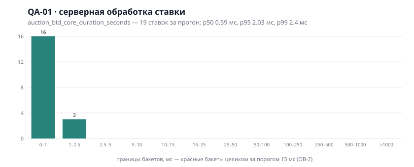
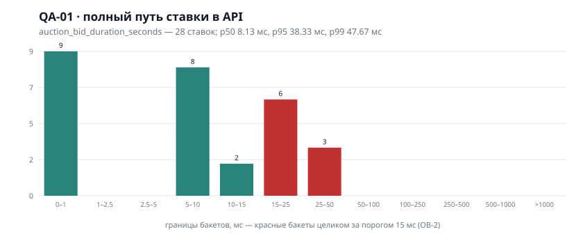
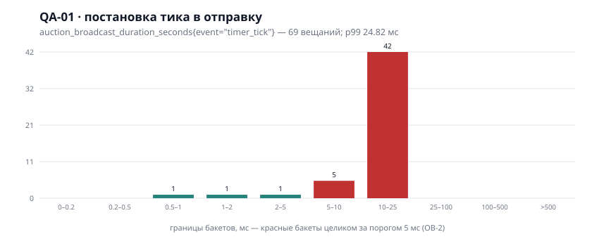
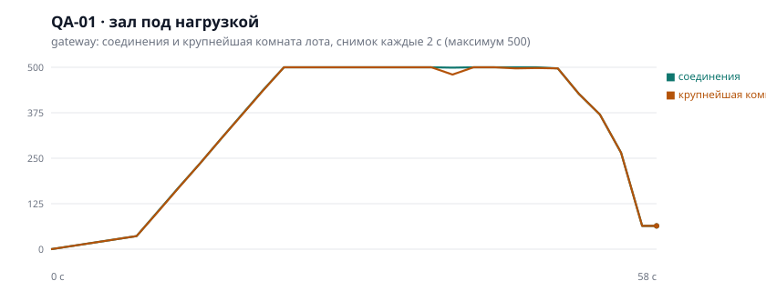

# Отчёт приёмки (T-055, §6 ТЗ)

**Дата прогона:** 19.08.2026
**Предмет:** «Цифровой гибридный аукцион скоростных продаж», ветка `main`
**Кто прогонял:** технический лид проекта (сессия разработки), прогоны фактические, не по памяти

---

## 1. Итог одной строкой

**Три приёмочных теста из четырёх — зелёные полностью. Четвёртый (QA-01) зелёный
по числу, которое требует его DoD, и не проверен на масштабе 50 000 клиентов:
одной машины для этого недостаточно физически, а stage-кластера пока нет.**

Отчёт **не подписывается как окончательный**: приёмка §6 ТЗ по букве требует
прогона на stage, которого не существует (T-009 ждёт инфраструктуру). Всё, что
можно проверить без кластера, проверено фактическим прогоном и приложено ниже.

---

## 2. Результаты по §6 ТЗ

| Тест      | Требование ТЗ                                                          | Как проверено                                                                                   | Результат                                                                                                            |
| --------- | ---------------------------------------------------------------------- | ----------------------------------------------------------------------------------------------- | -------------------------------------------------------------------------------------------------------------------- |
| **QA-01** | 50 000 сокет-клиентов на 1 лот, таймер стабилен, лаг ≤15 мс            | k6 `load/ws-hall.js`, 500 клиентов + метрики процессов                                          | **Частично**: обработка ставки p99 **2.4 мс** ✅, тики без пропусков **100 %** ✅, 50 000 клиентов не проверялись ❌ |
| **QA-02** | 100 кликов «+3 %» в 1 мс → принята ровно ОДНА, остальным новая цена    | `load/bid-race.ts`, 100 прогонов × 100 ставок × 2 сценария                                      | **Зелёный**: 1 принятая и 99 отказов с актуальной ценой на каждом прогоне ✅                                         |
| **QA-03** | При переподключении UI мгновенно ресинкает время с сервером            | `e2e/tests/disconnect.spec.ts` — настоящий браузер, обрыв связи                                 | **Зелёный**: RUNNING/FROZEN/FINISHED, расхождение остатка ≤1 тика ✅                                                 |
| **QA-04** | Подмена суммы через DevTools/Postman отклоняется при bid ≠ цена × 1.03 | `e2e/tests/auction-hall.spec.ts` (браузер, сокет мимо интерфейса) + `bid-rules`/`bid-audit` e2e | **Зелёный**: `PRICE_MISMATCH`, попытка в `audit_log` ✅                                                              |

### QA-01 подробно: что именно измерено

DoD задачи T-051 говорит про **серверную обработку** ставки. До T-053 такого
числа не существовало вовсе — мерили полный оборот через сеть, и приёмка
сверялась не с тем. Теперь замеряются обе величины по отдельности, и это меняет
вывод.

| Величина                                                  | p50     | p95     | p99        | Порог (ОВ-2) | Итог |
| --------------------------------------------------------- | ------- | ------- | ---------- | ------------ | ---- |
| **Ядро ставки** (атомарный Lua в Redis)                   | 0.59 мс | 2.03 мс | **2.4 мс** | ≤15 мс       | ✅   |
| Полный путь в процессе (частота → антибот → права → ядро) | 8.1 мс  | 38.3 мс | 47.7 мс    | ≤15 мс       | ❌   |
| Полный оборот с сетью (то, что видит k6)                  | 9.5 мс  | 43.4 мс | 49.7 мс    | —            | —    |
| Постановка тика в отправку комнате на 500 клиентов        | 16.1 мс | 24.1 мс | 24.8 мс    | ≤5 мс        | ❌   |
| Задержка ответа на ping (качество связи зала)             | 29.3 мс | 47.9 мс | 49.6 мс    | <2000 мс     | ✅   |

Прочее из того же прогона: соединений **500**, крупнейшая комната **500**,
тики без пропусков у **100 %** клиентов (DoD ≥99.9 %), снимок состояния при
входе получили **100 %** (875 из 875 сессий), принято 19 ставок и 9 отклонено по
частоте, пауза event loop p99 максимум **33 мс**.

**Почему полный путь не укладывается, а ядро укладывается.** Между приёмом
кадра и ядром стоят три обращения в PostgreSQL: пользователь, лот, задаток
(`checkEligibility`). Под нагрузкой они и дают хвост — ровно тот вывод, который
записан в `load/README.md` после T-051, теперь подтверждённый метрикой изнутри
процесса. Лечится кэшем допуска в Redis с коротким TTL; это работа, а не
настройка, и в объём T-055 она не входит.

**Почему вещание не укладывается.** 16–25 мс — это время, за которое один
процесс кладёт тик в 500 сокетов, то есть ~40 мкс на сокет на ноутбуке, где в
это же время работают k6, PostgreSQL, Redis и сам gateway. Порог ОВ-2 в 5 мс
рассчитан на комнату нормального размера на выделенном инстансе; на stage
проверять его нужно заново, и алерт `BroadcastAboveSla` именно для этого и
написан.

**Чего эти числа не доказывают.** Выборка ставок мала — 19 наблюдений, потому
что лимит FR-10 («1 ставка / 500 мс на IP») режет поток с одного генератора.
p99 по 19 наблюдениям это фактически «худшая из 19», и как оценка хвоста она
слабая. Для настоящего p99 нужны несколько генераторов с разных адресов — то же
условие, что и для 50 000 клиентов.

### Графики метрик

Собраны с `/metrics` живых процессов во время прогона (снимок каждые 2 с),
квантили посчитаны той же арифметикой, что `histogram_quantile` в Prometheus.
На stage эти же панели рисует Grafana по правилам из
`infra/observability/prometheus/auction.rules.yml`.

---

## 3. Что прогонялось и с каким результатом

| Прогон                                              | Объём                        | Результат           |
| --------------------------------------------------- | ---------------------------- | ------------------- |
| `pnpm lint`                                         | весь воркспейс               | ✅ чисто            |
| `pnpm typecheck`                                    | весь воркспейс               | ✅ чисто            |
| `pnpm format:check`                                 | весь воркспейс               | ✅ чисто            |
| Юнит-тесты api                                      | 12 файлов, 86 тестов         | ✅                  |
| Юнит-тесты web                                      | 4 файла, 31 тест             | ✅                  |
| E2E api на настоящих PostgreSQL и Redis             | 33 файла, 291 тест, ~4.8 мин | ✅                  |
| Браузерная приёмка (Playwright, три процесса + web) | 15 сценариев                 | ✅                  |
| Гонка ставок (QA-02)                                | 20 000 ставок, 200 прогонов  | ✅                  |
| Нагрузочный зал (QA-01)                             | 500 клиентов, 45 с           | ✅ по тикам, см. §2 |
| Правила и алерты Prometheus (`promtool test rules`) | 17 правил, 8+3 алерта        | ✅                  |
| `helm lint` + `helm template`                       | базовые и stage-значения     | ✅                  |

Окружение прогона: одна машина (Windows 11, ноутбук), PostgreSQL 17 на 5433,
Redis 7.2 (Memurai) на 6379, все процессы приложения и генератор нагрузки делят
один процессор.

---

## 4. Многоагентное ревью перед приёмкой

Перед подписанием проведено ревью шестью независимыми срезами (ядро и деньги,
безопасность и ПДн, данные и миграции, реалтайм и клиент, соответствие ТЗ,
тесты и наблюдаемость). Каждая находка проверялась встречным агентом, чья
задача — **опровергнуть** её по коду; при сомнении находка считалась
опровергнутой. Итог: 18 находок, 13 подтверждено.

**Исправлено в этом же проходе** (каждое — с регресс-тестом):

| Что                                                                     | Чем это грозило                                                                            |
| ----------------------------------------------------------------------- | ------------------------------------------------------------------------------------------ |
| Финиш торгов не переживал сбой PostgreSQL                               | Лот закрыт в Redis, «идёт» в базе: ни возврата задатков, ни протокола, и найти его нечем   |
| Одна битая запись останавливала перенос ставок целиком                  | Торги идут, лента истории пуста, ставок в юридической записи нет                           |
| Сверка возвратов не восстанавливала право участника №2 и бонус партнёра | Участник №2 терял выбор по FR-14, партнёр — свои 2 %                                       |
| `TRUST_PROXY_HOPS` не задавался в чартах                                | За ingress все участники сливаются в один адрес: лимит ставок становится общим на площадку |
| Ключи шифрования и blind index не сверялись на различие                 | Один ключ в обоих полях секрета — утечка поиска раскрывает сами ПДн                        |
| SLA Freeze не видел стабильно медленное соединение                      | Заморозка не наступала именно в том случае, ради которого написана                         |
| Мёртвый участник оставался в комнате навсегда                           | Комната не пустеет, канал не отписывается, тик рассылается лоту, которого никто не смотрит |
| Переподключение без разброса                                            | После выката gateway весь зал возвращается одной секундой                                  |
| Три номера банковских операций схлопывались в один                      | При отказе одного перевода из трёх сверить его с выпиской нечем                            |
| `bid_step_kzt` означал разное в снимке и в событии ставки               | После переподключения «шаг» на экране менялся при неизменной цене                          |
| CI не запускал ни юнит-тесты web, ни браузерную приёмку                 | Регресс ресинка, антибота и виджета задатка проходил бы мимо CI молча                      |
| Частичные индексы не были видны schema.prisma                           | Следующий `prisma migrate dev` мог их снести, сняв защиту от двух партнёров на один объект |

**Осознанно отложено** (названо, но не сделано):

1. **Backpressure медленного сокета.** `send` смотрит на `readyState`, но не на
   `bufferedAmount`: отстающий клиент копит кадры в буфере процесса. Правка
   требует решения, что делать с таким клиентом (пропускать тики, считать
   деградировавшим, рвать связь) — это решение уровня продукта, а не строчка кода.
2. **`Payment` без уникальности по лоту и без сверки зависшего PENDING.** Если
   банк откажет ровно между переводом лота в `CLOSED` и выставлением счёта,
   победитель не получит счёт, а повтор невозможен: лот уже в терминальном
   статусе. Правка ждёт настоящего банковского контура (риск R-2) — на моке
   чинить порядок операций и добавлять миграцию значит закреплять догадку о
   поведении банка.

---

## 5. Что НЕ проверено и почему

| Требование                                          | Почему не проверено                                                                         |
| --------------------------------------------------- | ------------------------------------------------------------------------------------------- |
| 50 000 клиентов на один лот (QA-01, NFR-03)         | Одна машина упирается в дескрипторы генератора; нужны несколько генераторов и stage (T-009) |
| Живой дашборд Grafana (T-053)                       | Нет кластера. Правила и все формулы панелей проверены `promtool` фактически                 |
| Дрейф часов ≤1 мс (NFR-04, T-010)                   | Нужны минимум две ноды                                                                      |
| Cloudflare: WAF, Turnstile, закрытый origin (T-050) | Нет аккаунта; конфигурация написана как код и не применялась                                |
| Реальные eGov / КИСИП / ЕРД                         | Доступов нет (R-1); работают адаптеры с моками                                              |
| Реальный банковский контур                          | Договора нет (R-2); работает `BankMockProvider`                                             |
| Юридические формы протокола и Акта ВЕТО             | Ждут юристов (ОВ-6); в коде заглушки, помеченные как заглушки                               |

---

## 6. Подпись

Отчёт составлен по фактическим прогонам, перечисленным в §3; числа §2 взяты из
`/metrics` живых процессов, а не из оценок. Пункты §5 — то, что проверить в этом
окружении невозможно; они не выдаются за проверенное.

Приёмка §6 ТЗ **может быть подписана после** прогона QA-01 на stage с
несколькими генераторами. Остальные три теста считаю закрытыми.
