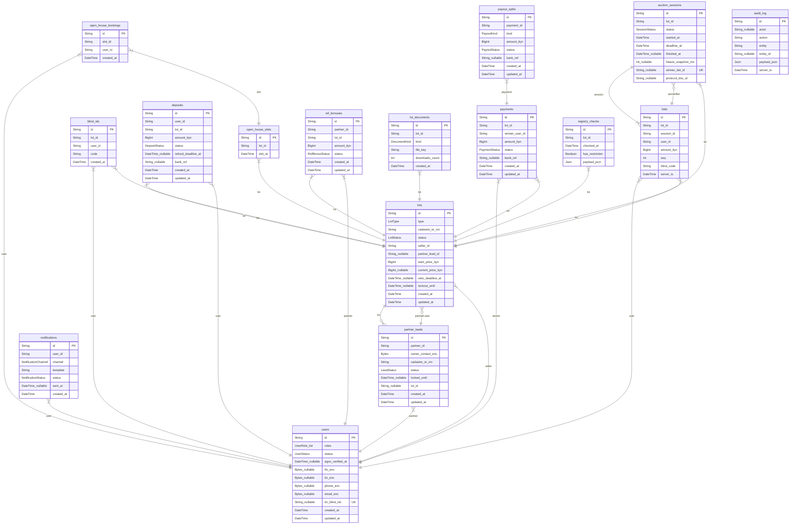

# ERD — схема БД

> Файл сгенерирован из `apps/api/prisma/schema.prisma` командой `pnpm db:erd`.
> Руками не править: правки затрутся при следующей генерации.

Моделей: 16, перечислений: 14.

Деньги везде в **целых тиынах** (`BigInt` → `BIGINT`), суффикс `_tiyn`.
ПДн — только в зашифрованных колонках `*_enc`.

## Диаграмма

## Перечисления

- **UserRole**: `INVESTOR`, `SELLER`, `PARTNER`, `ADMIN`
- **UserStatus**: `ACTIVE`, `BLOCKED`
- **LotType**: `REALTY`, `VEHICLE`
- **LotStatus**: `DRAFT`, `MODERATION`, `PHASE_I`, `PHASE_II`, `PHASE_III`, `FINISHED`, `CLOSED`, `PAUSED`, `VETOED`
- **SessionStatus**: `RUNNING`, `FROZEN`, `FINISHED`
- **DepositStatus**: `PENDING`, `HELD`, `ON_SPECIAL_ACCOUNT`, `RUNNERUP_HOLD`, `REFUND_PENDING`, `REFUNDED`, `FORFEITED`
- **PaymentStatus**: `PENDING`, `PAID`, `FAILED`
- **PayoutKind**: `FEE_5PCT`, `BANK_DEBT`, `SELLER_REST`
- **PayoutStatus**: `PENDING`, `SENT`, `CONFIRMED`, `FAILED`
- **LeadStatus**: `FREE_CHECKED`, `LOCKED`, `EXPIRED`, `CONVERTED`
- **RefBonusStatus**: `FORECAST`, `ACCRUED`, `PAID`
- **DocumentKind**: `DATA_ROOM`, `CERT_STO`, `PROTOCOL`, `VETO_ACT`
- **NotificationChannel**: `PUSH`, `SMS`
- **NotificationStatus**: `PENDING`, `SENT`, `FAILED`

## Таблицы

### `users`

| Колонка | Тип | Null | Комментарий |
| --- | --- | --- | --- |
| `id` | String (PK) | нет |  |
| `roles` | UserRole[] | нет |  |
| `status` | UserStatus | нет |  |
| `egov_verified_at` | DateTime | да |  |
| `fio_enc` | Bytes | да |  |
| `iin_enc` | Bytes | да |  |
| `phone_enc` | Bytes | да |  |
| `email_enc` | Bytes | да |  |
| `iin_blind_idx` | String (UNIQUE) | да |  |
| `created_at` | DateTime | нет |  |
| `updated_at` | DateTime | нет |  |

Индексы и ограничения:

- `@@index([status])`

### `lots`

| Колонка | Тип | Null | Комментарий |
| --- | --- | --- | --- |
| `id` | String (PK) | нет |  |
| `type` | LotType | нет |  |
| `cadastre_or_vin` | String | нет |  |
| `status` | LotStatus | нет |  |
| `seller_id` | String | нет |  |
| `partner_lead_id` | String | да |  |
| `start_price_tiyn` | BigInt | нет |  |
| `current_price_tiyn` | BigInt | да |  |
| `veto_deadline_at` | DateTime | да |  |
| `lockout_until` | DateTime | да | Цифровой карантин после ВЕТО: до этого момента лот заново не выставить (FR-17). |
| `created_at` | DateTime | нет |  |
| `updated_at` | DateTime | нет |  |

Индексы и ограничения:

- `@@index([status])`
- `@@index([type, status])`
- `@@index([cadastreOrVin])`

### `auction_sessions`

| Колонка | Тип | Null | Комментарий |
| --- | --- | --- | --- |
| `id` | String (PK) | нет |  |
| `lot_id` | String | нет |  |
| `status` | SessionStatus | нет |  |
| `started_at` | DateTime | нет |  |
| `deadline_at` | DateTime | нет | Авторитетный дедлайн торгов. TTL ключа в Redis — только страховка (T-027). |
| `finished_at` | DateTime | да |  |
| `freeze_snapshot_ms` | Int | да | Снимок остатка таймера на момент SLA Freeze, мс (FR-08). |
| `winner_bid_id` | String (UNIQUE) | да |  |
| `protocol_doc_id` | String | да |  |

Индексы и ограничения:

- `@@index([lotId, status])`
- `@@index([status, deadlineAt])`

### `bids`

| Колонка | Тип | Null | Комментарий |
| --- | --- | --- | --- |
| `id` | String (PK) | нет |  |
| `lot_id` | String | нет |  |
| `session_id` | String | нет |  |
| `user_id` | String | нет |  |
| `amount_tiyn` | BigInt | нет |  |
| `seq` | Int | нет | Номер ставки в сессии. Присваивается атомарно в Lua-скрипте (T-024). |
| `blind_code` | String | нет | Псевдоним участника в этом лоте — в ленте не должно быть реальных ID (FR-09). |
| `server_ts` | DateTime | нет | Только серверное время. Часы клиента не участвуют ни в чём (NFR-04). |

Индексы и ограничения:

- `@@unique([sessionId, seq])`
- `@@index([lotId, seq])`
- `@@index([userId])`

### `blind_ids`

| Колонка | Тип | Null | Комментарий |
| --- | --- | --- | --- |
| `id` | String (PK) | нет |  |
| `lot_id` | String | нет |  |
| `user_id` | String | нет |  |
| `code` | String | нет | Например «704» из «Инвестор #704». Уникален в рамках лота, между лотами меняется. |
| `created_at` | DateTime | нет |  |

Индексы и ограничения:

- `@@unique([lotId, userId])`
- `@@unique([lotId, code])`

### `deposits`

| Колонка | Тип | Null | Комментарий |
| --- | --- | --- | --- |
| `id` | String (PK) | нет |  |
| `user_id` | String | нет |  |
| `lot_id` | String | нет |  |
| `amount_tiyn` | BigInt | нет |  |
| `status` | DepositStatus | нет |  |
| `refund_deadline_at` | DateTime | да | SLA 24 ч на авто-возврат проигравшим (FR-12). |
| `bank_ref` | String | да |  |
| `created_at` | DateTime | нет |  |
| `updated_at` | DateTime | нет |  |

Индексы и ограничения:

- `@@unique([userId, lotId])`
- `@@index([status, refundDeadlineAt])`

### `payments`

| Колонка | Тип | Null | Комментарий |
| --- | --- | --- | --- |
| `id` | String (PK) | нет |  |
| `lot_id` | String | нет |  |
| `winner_user_id` | String | нет |  |
| `amount_tiyn` | BigInt | нет |  |
| `status` | PaymentStatus | нет |  |
| `bank_ref` | String | да |  |
| `created_at` | DateTime | нет |  |
| `updated_at` | DateTime | нет |  |

Индексы и ограничения:

- `@@index([status])`

### `payout_splits`

| Колонка | Тип | Null | Комментарий |
| --- | --- | --- | --- |
| `id` | String (PK) | нет |  |
| `payment_id` | String | нет |  |
| `kind` | PayoutKind | нет |  |
| `amount_tiyn` | BigInt | нет |  |
| `status` | PayoutStatus | нет |  |
| `bank_ref` | String | да |  |
| `created_at` | DateTime | нет |  |
| `updated_at` | DateTime | нет |  |

Индексы и ограничения:

- `@@unique([paymentId, kind])`

### `partner_leads`

| Колонка | Тип | Null | Комментарий |
| --- | --- | --- | --- |
| `id` | String (PK) | нет |  |
| `partner_id` | String | нет |  |
| `owner_contact_enc` | Bytes | нет | Контакты собственника — ПДн, только в зашифрованном виде. |
| `cadastre_or_vin` | String | нет |  |
| `status` | LeadStatus | нет |  |
| `locked_until` | DateTime | да | Закрепление за партнёром на 90 дней (FR-18). |
| `lot_id` | String | да |  |
| `created_at` | DateTime | нет |  |
| `updated_at` | DateTime | нет |  |

Индексы и ограничения:

- `@@index([cadastreOrVin, status])`
- `@@index([status, lockedUntil])`

### `ref_bonuses`

| Колонка | Тип | Null | Комментарий |
| --- | --- | --- | --- |
| `id` | String (PK) | нет |  |
| `partner_id` | String | нет |  |
| `lot_id` | String | нет |  |
| `amount_tiyn` | BigInt | нет |  |
| `status` | RefBonusStatus | нет |  |
| `created_at` | DateTime | нет |  |
| `updated_at` | DateTime | нет |  |

Индексы и ограничения:

- `@@unique([partnerId, lotId])`

### `lot_documents`

| Колонка | Тип | Null | Комментарий |
| --- | --- | --- | --- |
| `id` | String (PK) | нет |  |
| `lot_id` | String | нет |  |
| `kind` | DocumentKind | нет |  |
| `file_key` | String | нет |  |
| `downloads_count` | Int | нет |  |
| `created_at` | DateTime | нет |  |

Индексы и ограничения:

- `@@index([lotId, kind])`

### `open_house_slots`

| Колонка | Тип | Null | Комментарий |
| --- | --- | --- | --- |
| `id` | String (PK) | нет |  |
| `lot_id` | String | нет |  |
| `slot_at` | DateTime | нет |  |

Индексы и ограничения:

- `@@unique([lotId, slotAt])`

### `open_house_bookings`

| Колонка | Тип | Null | Комментарий |
| --- | --- | --- | --- |
| `id` | String (PK) | нет |  |
| `slot_id` | String | нет |  |
| `user_id` | String | нет |  |
| `created_at` | DateTime | нет |  |

Индексы и ограничения:

- `@@unique([slotId, userId])`

### `registry_checks`

| Колонка | Тип | Null | Комментарий |
| --- | --- | --- | --- |
| `id` | String (PK) | нет |  |
| `lot_id` | String | нет |  |
| `checked_at` | DateTime | нет |  |
| `has_restriction` | Boolean | нет | Ответ КИСИП/ЕРД: true → лот уходит в PAUSED (INT-02). |
| `payload_json` | Json | нет |  |

Индексы и ограничения:

- `@@index([lotId, checkedAt])`

### `notifications`

| Колонка | Тип | Null | Комментарий |
| --- | --- | --- | --- |
| `id` | String (PK) | нет |  |
| `user_id` | String | нет |  |
| `channel` | NotificationChannel | нет |  |
| `template` | String | нет |  |
| `status` | NotificationStatus | нет |  |
| `sent_at` | DateTime | да |  |
| `created_at` | DateTime | нет |  |

Индексы и ограничения:

- `@@index([userId, createdAt])`
- `@@index([status])`

### `audit_log`

Append-only журнал действий. UPDATE и DELETE запрещены триггером.

| Колонка | Тип | Null | Комментарий |
| --- | --- | --- | --- |
| `id` | String (PK) | нет |  |
| `actor` | String | да |  |
| `action` | String | нет |  |
| `entity` | String | нет |  |
| `entity_id` | String | да |  |
| `payload_json` | Json | нет |  |
| `server_ts` | DateTime | нет |  |

Индексы и ограничения:

- `@@index([entity, entityId])`
- `@@index([serverTs])`
